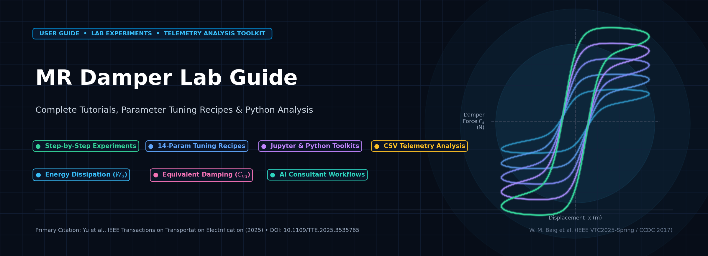
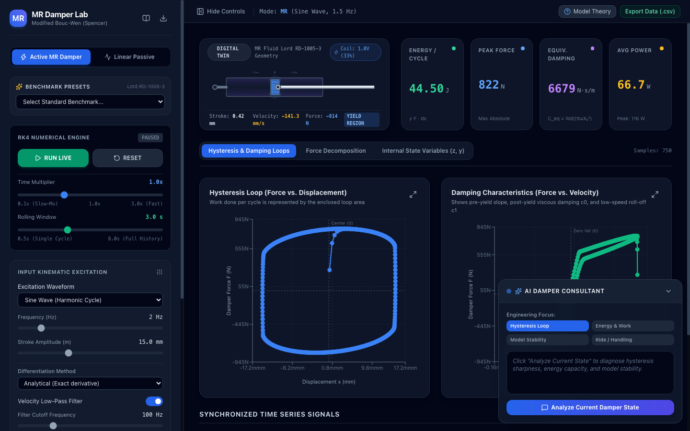
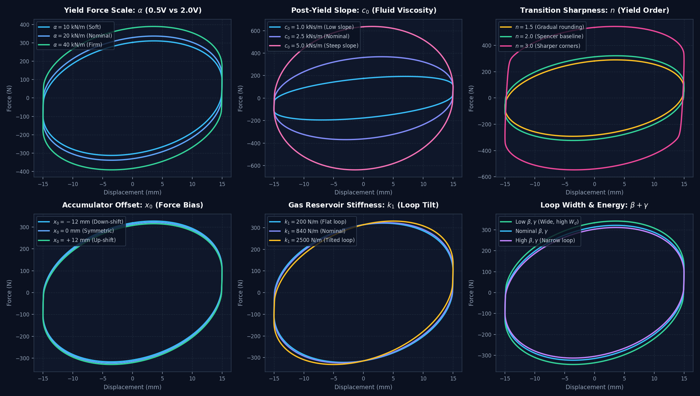
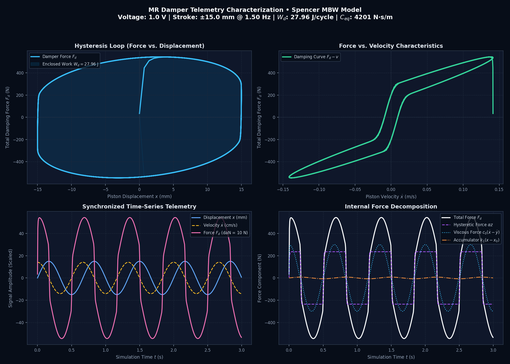
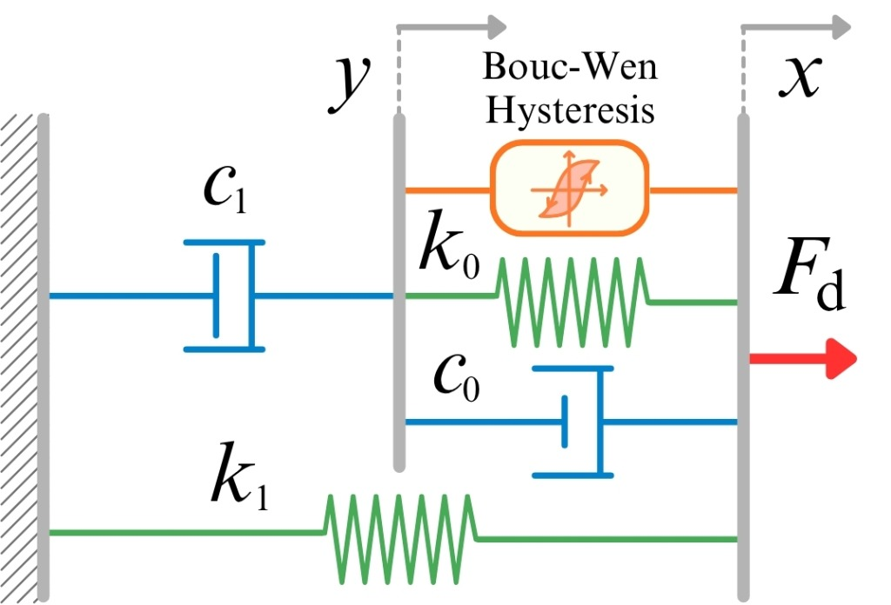

<p align="center">
  
</p>

<p align="center">
  <a href="https://modified-bouc-wen-model-simulation.ai.studio"></a>
  <a href="https://waqasmbaig.github.io/MR-Damper-Lab/"></a>
  <a href="https://opensource.org/licenses/MIT"></a>
  <a href="https://www.python.org/"></a>
  <a href="https://jupyter.org/"></a>
  <a href="https://doi.org/10.1109/TTE.2025.3535765"></a>
</p>

<p align="center">
  <a href="#-interactive-web-application"><b>Launch Web App</b></a> •
  <a href="#-laboratory-tutorials--experiments"><b>Tutorials</b></a> •
  <a href="#-parameter-tuning-cheat-sheet"><b>Tuning Guide</b></a> •
  <a href="#-python-telemetry-toolkit"><b>Python Toolkit</b></a> •
  <a href="#-jupyter-notebook-analysis"><b>Jupyter Notebook</b></a> •
  <a href="#-citation-request"><b>Citations</b></a>
</p>

---

## 📖 Overview

**MR Damper Lab** is the dedicated companion repository, user guide, experiment curriculum, and data analysis toolkit for the **[Modified Bouc-Wen MR Damper Web Simulator](https://modified-bouc-wen-model-simulation.ai.studio)**.

Whether you are a student exploring nonlinear hysteresis for the first time, a researcher designing vehicle semi-active suspension controllers, or an engineer fitting experimental damper dynamometer data, this repository provides:
- 📘 **5 Structured Laboratory Tutorials**: From basic UI operation to Skyhook semi-active control algorithms.
- 🎛️ **Parameter Sensitivity Guide**: Detailed physical breakdown and visual tuning recipes for all 14 Spencer parameters.
- 🐍 **Python Telemetry Analysis Toolkit**: Instant command-line tools to calculate energy dissipation ($W_d$), equivalent viscous damping ($C_{eq}$), and plot 4-panel telemetry figures from exported CSV files.
- 📓 **Interactive Jupyter Notebook**: Step-by-step data processing, hysteresis curve extraction, and FFT harmonic distortion analysis.

---

## 🚀 Interactive Web Application

The simulation runs 100% in-browser with zero installation required:

<table>
  <tr>
    <td align="center" width="50%">
      <h3>🌐 Primary Host (Google AI Studio)</h3>
      <p>High-performance web deployment with real-time 60 FPS physics.</p>
      <a href="https://modified-bouc-wen-model-simulation.ai.studio">
        
      </a>
      <br/><br/>
      <code>https://modified-bouc-wen-model-simulation.ai.studio</code>
    </td>
    <td align="center" width="50%">
      <h3>🐙 Secondary Mirror (GitHub Pages)</h3>
      <p>Direct mirror hosted on GitHub Pages for offline caching.</p>
      <a href="https://waqasmbaig.github.io/MR-Damper-Lab/">
        
      </a>
      <br/><br/>
      <code>https://waqasmbaig.github.io/MR-Damper-Lab/</code>
    </td>
  </tr>
</table>

<p align="center">
  
</p>

---

## 📚 Laboratory Tutorials & Experiments

Explore the step-by-step guides located in the [`docs/tutorials/`](docs/tutorials/) directory:

| Tutorial | Document | Key Learning Outcomes |
| :--- | :--- | :--- |
| **01. Getting Started** | [`01_getting_started.md`](docs/tutorials/01_getting_started.md) | UI layout, operating modes (Active MR vs Passive), digital twin yield states, and one-click CSV telemetry export. |
| **02. Hysteresis Experiments** | [`02_hysteresis_experiments.md`](docs/tutorials/02_hysteresis_experiments.md) | 5 systematic experiments: voltage sweep dynamic range, excitation frequency sensitivity, stroke amplitude linearity, and triangle wave constant velocity tests. |
| **03. Parameter Tuning Guide** | [`03_parameter_tuning_guide.md`](docs/tutorials/03_parameter_tuning_guide.md) | Physical interpretation of all 14 Spencer parameters ($\alpha, c_0, c_1, k_0, k_1, x_0, \beta, \gamma, n, A, \eta$) and loop troubleshooting. |
| **04. AI Consultant Workflows** | [`04_ai_assistant_prompts.md`](docs/tutorials/04_ai_assistant_prompts.md) | Leveraging the built-in Gemini 3.8 vibration consultant for loop sharpness optimization, stability checks, and automotive suspension trade-offs. |
| **05. Semi-Active Control** | [`05_semi_active_control.md`](docs/tutorials/05_semi_active_control.md) | Implementing Karnopp 2-State Skyhook control, Groundhook damping, and torque coordination for vehicle vibration suppression. |

---

## 🎛️ Parameter Tuning Cheat Sheet

Understanding how each parameter shapes the Force–Displacement ($F-x$) and Force–Velocity ($F-v$) hysteresis response:

<p align="center">
  
</p>

- **Yield Force ($\alpha$)**: Dictates vertical loop expansion; linearly scales with command voltage $V$.
- **Post-Yield Viscous Damping ($c_0$)**: Dictates the slope of the hysteresis top and bottom plateaus.
- **Yield Sharpness ($n$)**: $n = 1.5$ produces a gradual transition; $n \ge 3.0$ produces sharp bilinear corners.
- **Gas Accumulator Stiffness ($k_1$)**: Tilts the principal axis of the loop upwards with positive displacement.
- **Accumulator Offset ($x_0$)**: Introduces a vertical static force offset (essential for vehicle strut static load support).
- **Hysteresis Shape ($\beta + \gamma$)**: Controls the horizontal width of the loop and energy dissipation capacity.

---

## 🐍 Python Telemetry Toolkit

The repository provides automated tools to process telemetry files exported from the web app:

```bash
# 1. Install dependencies
pip install -r requirements.txt

# 2. Analyze any exported CSV telemetry file
python3 scripts/analyze_telemetry.py data/sample_harmonic_sweep.csv --save docs/assets/telemetry_analysis_sample.png
```

### Generated Characterization Plot:
<p align="center">
  
</p>

### Terminal Report Output:
```text
=======================================================
   MAGNETORHEOLOGICAL DAMPER TELEMETRY REPORT
=======================================================
Command Voltage         : 1.00 V
Stroke Amplitude        : ±15.00 mm
Excitation Frequency    : 1.50 Hz
Peak Force (F_max)      : +544.0 N
Min Force (F_min)       : -545.5 N
Peak Magnitude          : 545.5 N
Energy Dissipated (W_d) : 27.963 J/cycle
Equiv. Damping (C_eq)   : 4200.8 N·s/m
Peak Power Dissipation  : 76.5 W
Average Power           : 42.0 W
=======================================================
```

---

## 📓 Jupyter Notebook Analysis

Launch the interactive Jupyter notebook in [`notebooks/mr_damper_telemetry_analysis.ipynb`](notebooks/mr_damper_telemetry_analysis.ipynb):

```bash
jupyter notebook notebooks/mr_damper_telemetry_analysis.ipynb
```

The notebook guides you through:
1. Loading raw CSV data exported from the simulator.
2. Integrating the hysteresis loop area using trapezoidal quadrature to calculate work dissipated per cycle:
   $$W_d = \oint F_d \, dx$$
3. Computing equivalent linear viscous damping coefficient:
   $$C_{eq} = \frac{W_d}{\pi \omega X_0^2}$$
4. Performing Fast Fourier Transform (FFT) spectral decomposition to identify odd-harmonic distortion ($3f_0, 5f_0, 7f_0$) caused by Bouc-Wen nonlinear yield saturation.

---

## 🔬 Mathematical Formulation

The physical equations of Spencer's 14-parameter Modified Bouc-Wen phenomenological model:

<p align="center">
  
</p>

1. **Total Reaction Force**:
   $$F_d = c_1 \dot{y} + k_1 (x - x_0) = \alpha z + c_0 (\dot{x} - \dot{y}) + k_0 (x - y) + k_1 (x - x_0)$$
2. **Intermediate Node Kinematics**:
   $$\dot{y} = \frac{1}{c_0 + c_1} \Big[ \alpha z + c_0 \dot{x} + k_0 (x - y) \Big]$$
3. **Evolutionary Hysteretic State**:
   $$\dot{z} = A (\dot{x} - \dot{y}) - \beta |\dot{x} - \dot{y}| |z|^{n-1} z - \gamma (\dot{x} - \dot{y}) |z|^n$$
4. **Coil Inductance Lag & Field Dependencies**:
   $$\dot{u} = -\eta (u - V) \qquad \alpha(u) = \alpha_a + \alpha_b u \qquad c_0(u) = c_{0a} + c_{0b} u \qquad c_1(u) = c_{1a} + c_{1b} u$$

---

## 🔗 Related Repositories

- **[Modified-Bouc-Wen-Model-Simulation](https://github.com/waqasmbaig/Modified-Bouc-Wen-Model-Simulation)**: Source code and automated GitHub Pages deployment for the web application.
- **[MRD-Modified-Bouc-Wen-Model](https://github.com/waqasmbaig/MRD-Modified-Bouc-Wen-Model)**: Core research repository featuring MATLAB / Simulink (`MRD_FDFV.slx`), Python stiff ODE solvers (SciPy Radau), and a 2-DOF Quarter-Car Skyhook suspension vibration benchmark.

---

## 📄 Citation Request

If you use this laboratory guide, tutorials, simulation framework, or telemetry analysis tools in your research, academic publications, or vehicle vibration control studies, **please cite the following publications**:

### Primary Research Publications

1. **[J1] Journal Paper (IEEE TTE 2025)**:
   > Z. Yu, R. Luo, P. Wu, **W. M. Baig**, H. Ma, and Z. Hou, "Robust finite-frequency vibration control of in-wheel motor driving vehicles based on torque coordination and motor suspension," *IEEE Transactions on Transportation Electrification*, 2025.  
   > **DOI:** [10.1109/TTE.2025.3535765](https://doi.org/10.1109/TTE.2025.3535765)

2. **[C1] Conference Paper (IEEE VTC2025-Spring)**:
   > **W. M. Baig**, Z. Yu, H. Ma, and Z. Hou, "Adaptive vibration control of in-wheel motor drive vehicles with preview information," in *Proc. IEEE 101st Vehicular Technology Conference (VTC2025-Spring)*, Oslo, Norway, 2025.  
   > **DOI:** [10.1109/VTC2025-Spring65109.2025.11174543](https://doi.org/10.1109/VTC2025-Spring65109.2025.11174543)

3. **[C5] Conference Paper (CCDC 2017)**:
   > **W. M. Baig**, Z. Hou, and S. Ijaz, "Fractional order controller design for a semi-active suspension system using Nelder–Mead optimization," in *Proc. 29th Chinese Control and Decision Conference (CCDC)*, 2017, pp. 2808–2813.

<details>
<summary><b>Click to Expand BibTeX Entries</b></summary>

```bibtex
@article{yu2025robust,
  title={Robust finite-frequency vibration control of in-wheel motor driving vehicles based on torque coordination and motor suspension},
  author={Yu, Z. and Luo, R. and Wu, P. and Baig, W. M. and Ma, H. and Hou, Z.},
  journal={IEEE Transactions on Transportation Electrification},
  year={2025},
  publisher={IEEE},
  doi={10.1109/TTE.2025.3535765}
}

@inproceedings{baig2025adaptive,
  title={Adaptive vibration control of in-wheel motor drive vehicles with preview information},
  author={Baig, W. M. and Yu, Z. and Ma, H. and Hou, Z.},
  booktitle={Proc. IEEE 101st Vehicular Technology Conference (VTC2025-Spring)},
  address={Oslo, Norway},
  year={2025},
  doi={10.1109/VTC2025-Spring65109.2025.11174543}
}

@inproceedings{baig2017fractional,
  title={Fractional order controller design for a semi-active suspension system using Nelder--Mead optimization},
  author={Baig, W. M. and Hou, Z. and Ijaz, S.},
  booktitle={Proc. 29th Chinese Control and Decision Conference (CCDC)},
  pages={2808--2813},
  year={2017}
}
```
</details>

---

## 📜 License

This project is licensed under the [MIT License](LICENSE).
